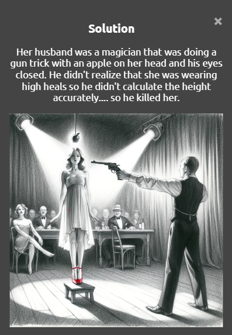

# Mistory Game

Mistory is a web-based game that challenges players to solve mysteries using yes-or-no questions. The AI-powered backend processes user queries and returns responses to guide the player towards the solution.

## Interface & Gameplay

Here’s a glimpse of Mistory’s interface and gameplay. The following images showcase the main game screen, question prompts, and response feedback:

### Main Interface

This is where players ask yes-or-no questions and interact with the AI-powered backend. The clean and minimalist design helps players focus on solving the mystery.

### Gameplay Interaction

In this part of the gameplay, players receive answers from the AI as they work to uncover clues. Each response is carefully prompt engineered to ensure that the user does not get confused.

### Show Answer

This part of the interface reveals the answer after the player submits their final guess or opts to see the solution.

## Authors

* **Randy El Haddad** - [RandyHaddad](https://github.com/RandyHaddad)

## License

This project is licensed under the MIT License - see the [LICENSE](LICENSE) file for details.

## Acknowledgments

* Thanks to OpenAI for providing the GPT-3 API.
* Inspiration from traditional mystery-solving games.
* The Flask community for their helpful resources.
