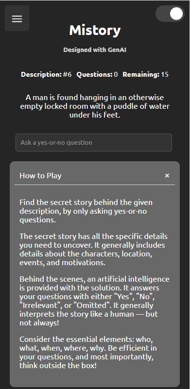
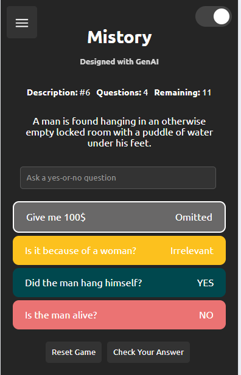

# Mistory Game

Mistory is a web-based game that challenges players to solve mysteries using yes-or-no questions. The AI-powered backend processes user queries and returns responses to guide the player towards the solution.

## Interface & Gameplay

Here’s a glimpse of Mistory’s interface and gameplay. The following images showcase the main game screen, question prompts, and response feedback:

### Main Interface


This is where players ask yes-or-no questions and interact with the AI-powered backend. The clean and minimalist design helps players focus on solving the mystery.

### Gameplay Interaction


In this part of the gameplay, players receive answers from the AI as they work to uncover clues. Each response is carefully prompt engineered to ensure that the user does not get confused.

## Getting Started

Clone the repository to get a local copy that you can run and test.

### Prerequisites

You'll need Python and Flask installed on your system. Optionally, set up a virtual environment to manage dependencies.

```bash
pip install flask
```

### Installing

Follow these steps to set up your development environment:

```bash
git clone https://github.com/YourUsername/Mistory.git
cd Mistory
pip install -r requirements.txt
```

Run the Flask application:

```bash
flask run
```

Navigate to `localhost:5000` in your web browser to see the game in action.

## Running the Tests

To run automated tests, use the following command:

```bash
python -m unittest discover
```

## Deployment

Deploy the application to a web server or cloud platform such as Heroku or AWS.

## Built With

* [Flask](https://flask.palletsprojects.com/) - The web framework used
* [OpenAI](https://openai.com/api/) - AI service for generating responses

## Contributing

Please read CONTRIBUTING.md for details on our code of conduct, and the process for submitting pull requests.

## Versioning

We use [SemVer](http://semver.org/) for versioning.

## Authors

* **Your Name** - *Initial work* - [YourUsername](https://github.com/YourUsername)

## License

This project is licensed under the MIT License - see the [LICENSE](LICENSE) file for details.

## Acknowledgments

* Thanks to OpenAI for providing the GPT-3 API.
* Inspiration from traditional mystery-solving games.
* The Flask community for their helpful resources.
